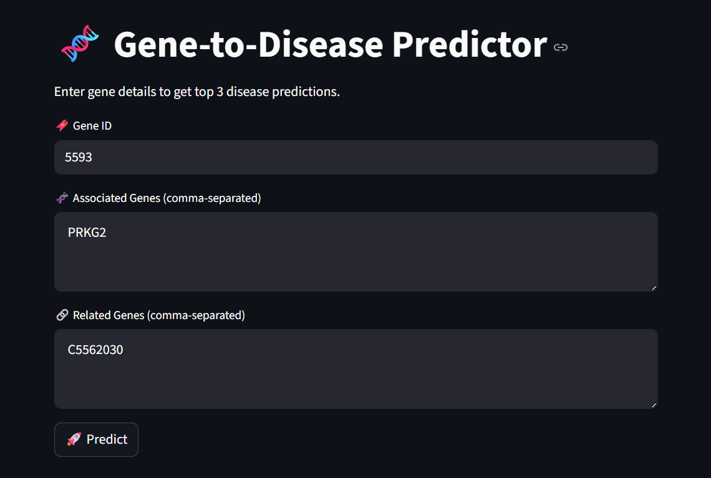
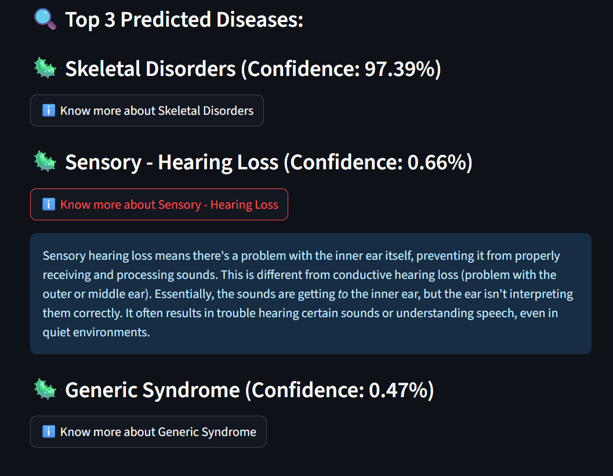

# 🧬 Gene-to-Disease Prediction System

An AI-powered **Gene → Disease Prediction System** that uses **Natural Language Processing (NLP)** and **Deep Learning (LSTM)** to predict possible diseases based on genetic information.  
The system also integrates **Generative AI (Google Gemini)** to explain predicted diseases in **simple, human-readable language**.

---

## 🚀 Project Overview

This project takes **genetic inputs** such as:
- Gene ID  
- Associated Genes  
- Related Genes  

and predicts the **top 3 most likely disease categories** with confidence scores.  
It is built as an **end-to-end ML application**, from **model training** to a **Streamlit-based frontend** with GenAI-powered explanations.

---

## 📸 Application Screenshots

### 🏠 Homepage

### 🔍 Disease Prediction Results

---

## 🧠 Model Building Pipeline

### 1️⃣ Data Ingestion & Cleaning
- Dataset loaded from `cleaned_gene_cond.csv`
- **Regex-based parsing** used to correctly split fields containing commas inside quotes
- Data standardization:
  - Disease names → lowercase
  - Gene symbols → uppercase
  - Removed extra quotes and whitespace

---

### 2️⃣ Feature Engineering
- Genetic data treated as **textual sequences**, not numerical values
- Created a new feature `combined_text` by concatenating:
GeneID + AssociatedGenes + RelatedGenes

- Example:
"51524 TMEM138 C3280906"

---

### 3️⃣ Data Filtering & Splitting
- Removed disease classes with fewer than **2 samples**
- Final dataset contained **658 valid disease classes**
- Labels encoded using `LabelEncoder`
- Train/Test split:
- 80% training
- 20% testing
- Stratified to maintain class balance

---

### 4️⃣ Text Preprocessing (NLP)
- **Keras Tokenizer**
- Vocabulary size: 10,000
- Converted text to integer sequences
- Padded/truncated all sequences to **length = 20**

---

### 5️⃣ Model Architecture
Built using **TensorFlow / Keras Sequential API**

| Layer | Description |
|-----|------------|
| Embedding | Converts tokens into 128-dimensional dense vectors |
| LSTM | 64 units to capture gene relationships |
| Dense (Softmax) | Outputs disease probabilities |

---

### 6️⃣ Model Training
- Loss Function: `sparse_categorical_crossentropy`
- Optimizer: `Adam`
- Epochs: 10  
- Batch Size: 32  

---

### 7️⃣ Iteration & Refinement (Clustering)
Initial accuracy was low due to **high disease cardinality**.

**Solution:**
- Applied **TF-IDF Vectorization** on disease names
- Used **K-Means Clustering** to group diseases into **15 broad categories**
- Retrained the LSTM model on these clusters

✅ **Result:**  
- **Top-3 Accuracy ≈ 89%**

---

## 🖥️ Application Architecture

### 1️⃣ Frontend (Streamlit)
**File:** `app.py`

- User inputs:
  - Gene ID
  - Associated Genes
  - Related Genes
- Clicks **🚀 Predict**
- Displays:
  - Top 3 predicted diseases
  - Confidence scores
  - “ℹ️ Know more” button for each disease

---

### 2️⃣ Input Preprocessing
**File:** `preprocessing.py`

- Loads saved tokenizer
- Combines user inputs into a single string
- Converts text → sequence
- Pads sequence to fixed length (20)

---

### 3️⃣ Prediction Engine
**File:** `predictor.py`

- Loads:
  - Trained model
  - Label encoder
- Runs inference
- Sorts probabilities
- Returns **Top-3 disease predictions with confidence**

---

### 4️⃣ GenAI Disease Explanation
**File:** `gpt_api.py`

- Uses **Google Gemini API**
- API key stored securely in `.env`
- Generates:
  > “Simple, non-technical explanation of the disease”

Displayed directly inside the Streamlit app.

---

## 🧪 Example Input

Gene ID: 144568
Associated Genes: BRCA1, TP53
Related Genes: ATM, CHEK2

---

## 📊 Example Output

1️⃣ Myopathy-related Disorder – 41.2%
2️⃣ Genetic Syndrome – 27.8%
3️⃣ Reproductive Disorder – 20.1%

Each result includes an AI-generated explanation.

---

## 🔐 Environment Variables

Create a `.env` file:

GEMINI_API_KEY=your_api_key_here

> ⚠️ `.env` is included in `.gitignore` for security.

---

## 🛠️ Tech Stack

- **Python**
- **TensorFlow / Keras**
- **Scikit-learn**
- **Streamlit**
- **Google Gemini API**
- **NLP (Tokenizer, TF-IDF)**
- **LSTM Neural Networks**

---

## 🎯 Key Highlights

- End-to-end ML pipeline
- NLP-based genetic feature modeling
- Disease clustering to handle high cardinality
- GenAI-powered explainability
- Clean modular architecture
- Real-world deployment ready

---

## 📌 Future Improvements
- Support for multi-gene weighting
- Explainable AI (attention visualization)
- Larger genomic datasets
- API-based deployment
